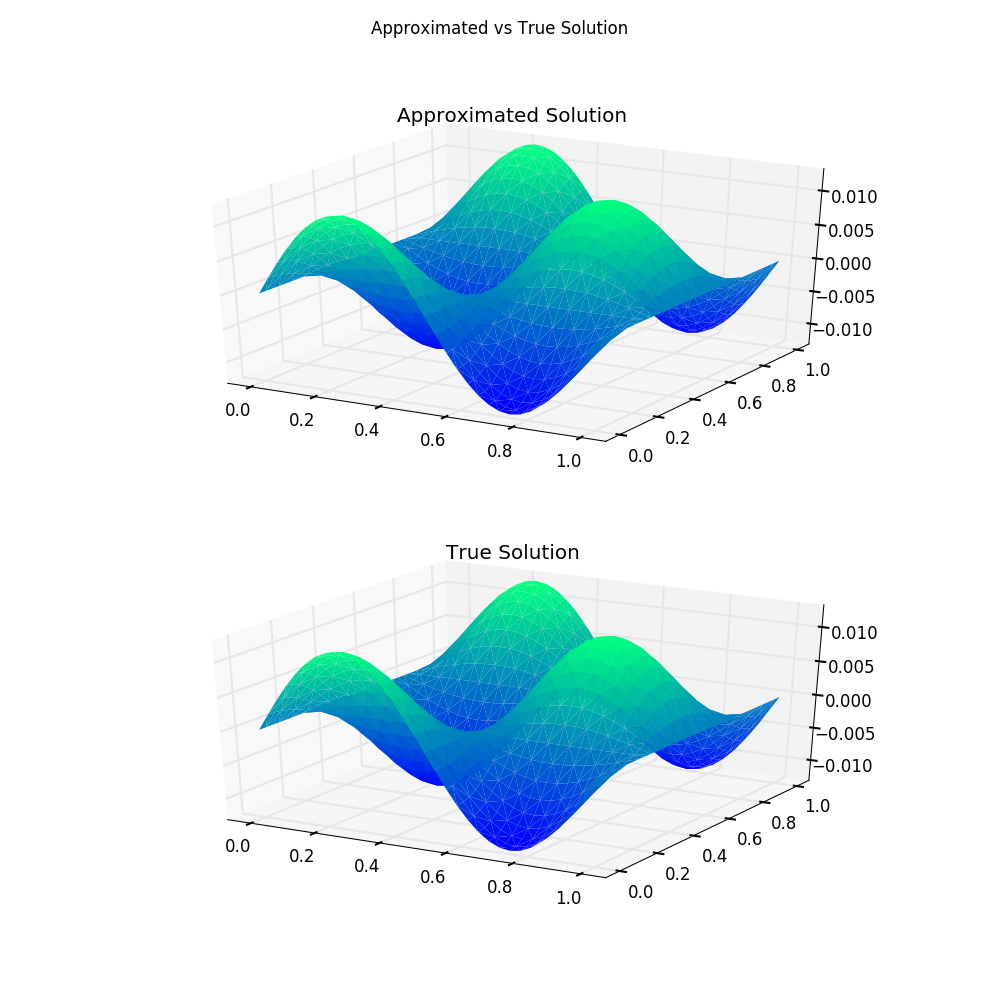

# Poisson Equation Finite Element Method

This tutorial will introduce you to the functionality for solving a PDE. Other
introductions can be found by [checking out the IJulia notebooks in the examples
folder](https://github.com/JuliaDiffEq/DifferentialEquations.jl/tree/master/examples).

In this example we will solve the Poisson Equation ``Δu=f``. For our example, we will take the linear equation where ``f(x,y) = \sin(2πx)\cos(2πy)``. For this equation we know that solution is ``u(x,y,t)= \sin(2πx)\cos(2πy)/(8π^2)`` with gradient ``Du(x,y) = [\cos(2πx)\cos(2πy)/(4π) -\sin(2πx)\sin(2πy)/(4π)]``. Thus, we define a PoissonProblem as follows:

```julia
f(x) = sin(2π.*x[:,1]).*cos(2π.*x[:,2])
gD(x) = sin(2π.*x[:,1]).*cos(2π.*x[:,2])/(8π*π)
prob = PoissonProblem(f,gD)
```

Or we can use the `@fem_define` macro to beautify our code. The first argument is
the function signature, which here is `(x)`. Second it's a list of variables to
convert. This makes more sense in the Heat Equation examples, so we put in the
blank expresion `()` for now. Then we put in our expression, and lastly we define
the parameter values. `@fem_define` will automatically replace `x` by `x[:,1]` and
`y` by `x[:,2]`, and will also subtitute in the defined parameters. The previous
definition using `@fem_define` is as follows:

```julia
f  = @fem_define((x),(),begin
  sin(α.*x).*cos(α.*y)
end,α=>2π)
gD = @fem_define((x),(),begin
  sin(α.*x).*cos(α.*y)/β
end,α=>2π,β=>8π*π)
```

The linebreaks are not required but I think it makes it more legible!

Here we chose the dirichlet boundary condition `gD` to give the theoretical solution.  Other example problems can be found in [src/examples/exampleProblems.jl](https://github.com/JuliaDiffEq/DifferentialEquations.jl/tree/master/src/premades/premade_problems.jl). To solve this problem, we first have to generate a mesh. Here we will simply generate a mesh of triangles on the square [0,1]x[0,1] with Δx=2^(-5). To do so, we use the code:

```julia
Δx = 1//2^(5)
fem_mesh = notime_squaremesh([0 1 0 1],Δx,:dirichlet)
```

Note that by specifying :dirichlet our boundary conditions is set on all boundaries to dirichlet. This gives an FEMmesh object which stores a finite element mesh in the same layout as [iFEM](http://www.math.uci.edu/~chenlong/programming.html). Notice this code shows that the package supports the use of rationals in meshes. Other numbers such as floating point and integers can be used as well. Finally, to solve the equation we use

```julia
sol = solve(fem_mesh,pdeProb)
```

solve takes in a mesh and a PoissonProblem and uses the solver to compute the solution. Here the solver was chosen to be GMRES. Other solvers can be found in the documentation. This returns a FEMSolution object which holds data about the solution, such as the solution values (u). To plot the solution, we use the command

```julia
plot(sol::FEMSolution)
Plots.gui()
```

Here is the plot shown against the analytical solution to show the accuracy:


